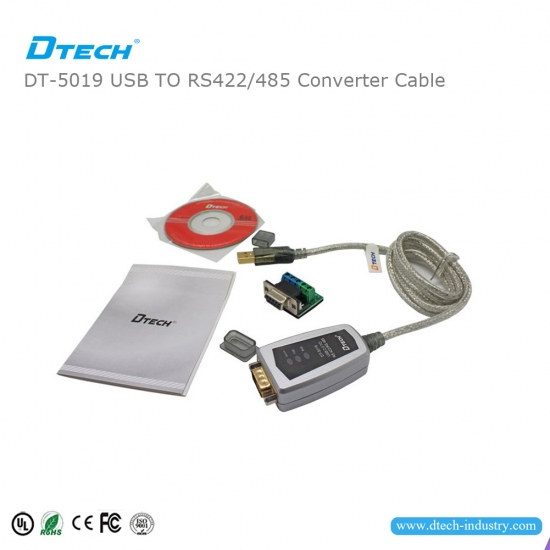

# Soalr VFD Settings!

## Table of Contents

- [Background](#background)
- [Hardware](#hardware)
- [Wiring](#wiring)
- [Software](#software)
- [Steps](#steps)
- [Additional Resources](#Additional-Resources)

## Background

This is a short documentation on how to connect Invt Solar VFD using a laptop via Serial Bus.`

Most VFDs come with 6-button HMI that can be used to inspect/set the required settings. With over 100 parameters to be set, this HMI becomes impractical and make the process very tedious. The Serial Bus connection enables technichians to import/export and adjust all the settings in a human-readble CSV file.

## Hardware
To proceed you will need the follwoing Hardware:
1. [INVT VFD](https://www.invt.com/variable-frequency-drive).
2. A Laptop with Windows Operating System - INVT Studio is only available for Windows at the moment-.
3. [USB to RS485 Converter](https://www.dtechelectronics.com/dtech-dt-5019-usb-to-rs485-422-cable_p118.html).

## Wiring
In most VFDs the ports for serial communication are marked as `RS485+` and `RS485-`. Your connection should look like the below diagram.

## Software 
1. [USB to RS485 Converter Driver](https://www.dtechelectronics.com/uploadfile/downloads/Windows%207,8,10.zip). This a nesccary driver to recognize the converter.
2. [Invt Studio](https://www.invt.com/uploads/file1/20200702/INVT%20Studio.rar) used to communicate with your invt device.

## Steps:
1. Install `USB to RS485 Converter Driver`.
2. Install `Invt Studio`.
3. Restart your Laptop.
4. Open Invt Studio and have fun.

##  Additional Resources:
